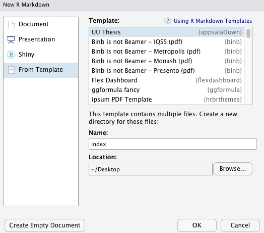

# uppsaladown

The `uppsaladown` package provides a template for writing a thesis at the Department 
of Statistics at Uppsala University. The package is modified version of the `huwiwidown` package.

Users write in `R Markdown` (which is basically a flavor of the `Markdown`
markup language but with the ability to incorporate R code chunks using the
`knitr` package), and the `bookdown` package (powered by
[pandoc](https://pandoc.org) ) is used to convert the code into LaTeX code and
finally into a PDF document. There's other formats that can be created too, such
as html documents, but that is outside the scope of this package.

In the event that you've never used `bookdown` before, check out this [handy
tutorial](https://bookdown.org/yihui/bookdown/).

## Introduction

The purpose of this template is to make it easy to use R and R Studio that you are already
familiar with to write your thesis. The template uses Markdown which is a easy-to-use, 
lightweight, no-frills markup language.

An example of the output can be seen [here](thesis-example.pdf).

## Usage

### Initial Setup

1. To install the template, be sure you have the following:
    - [pandoc](http://pandoc.org/)
    - [LaTeX](https://www.latex-project.org/get/)
    - [R >= 3.5.1](https://r-project.org)
    - [RStudio](https://rstudio.org) (optional, but it helps)

    A version of pandoc is included with RStudio and LaTeX is installed with bookdown below.
    So in practice, it should be enough to have R and RStudio installed.

2. Install the necessary packages:

```r
if (!require("devtools")) {
  install.packages("devtools", repos = "http://cran.rstudio.org")
}
install.packages("bookdown")
devtools::install_github("lpandersson/uppsaladown")
```
3. Create a New R Markdown document:

File -> New File -> R Markdown... then choose 'From template', then choose
'UU Thesis", and enter `index` as the **Name**. Note that this will currently
only **Knit** if you name the directory `index` at this step.

<p align="center">
  
</p>

If you're not using RStudio, navigate to an empty directory and then run the
following code:

```r
rmarkdown::draft("index.Rmd", template = "uu_thesis", package = "uppsaladown")
```

Note that it may be necessary to restart RStudio for this to work.

### Rendering

To render your thesis, you can open `index.Rmd` in RStudio and then hit the
"knit" button. Alternatively, you can use:

```r
rmarkdown::render("index.Rmd")
```

Your thesis will be deposited in the `thesis-output/` directory. The first time you render
the thesis, it may take a while. I should be faster after that.

## Components

The following describes the components in the template.

### `index.Rmd`

This file is first created when generating a new template. It contains all the
relevant meta-information (e.g. name, thesis title, advisor names). You will
need to fill out the sections at the top of the page, which will then
auto-populate your "Title Page" and "Declaration of Authorship". If you are also
familiar with the YAML header, you can also add additional LaTeX parameters or
decide whether you want to add optional pages to your thesis such as the
"Acknowledgements" section or the "List of Tables".

### `_bookdown.yml`

This is the main configuration file for your thesis. It determines what Rmd
files are included in the output, and in what order. Arrange the order of your
chapters in this file and ensure that the names match the names in your folders.
The first file should always be the `index.Rmd` file. The rest will be the files
that you create. Some example files are already included to help you along your
way.

### `sections/`

These are the sections or chapters that will be bound together in the final
render. Here's where you write the sections that make your thesis. You can name
the files whatever you like, so long as they are indexed in the `_bookdown.yml`
file.

Note that you will not need to change `98-references.Rmd` as the bibliography
will be auto-generated in alphabetically order so long as you cite that item
in the text and your bibliography is correctly located in `bib/references.bib`.
References should stay in that position to ensure it appears after the text but
before the appendix.

### `bib/`

Store your bibliography (as `bibtex` files) here.
[This website](http://bibdesk.sourceforge.net/) may be helpful in generating the
`bibtex` file in the correct format. But, in most journal databases, Google scholar etc.,
there is an option to view the reference in bibtex-format and so copy-pasting that into the bibtex
file is usually enough.

### `figures/` and `data/`

Store your figures and data here and reference them in your R Markdown files.

## Structure of Thesis

The template of the thesis comes with a default structure that may be useful in many cases, 
but that is not required. Discuss with you advisor what is a good structure for your thesis.


The default structure is as follows:

**Frontmatter:**

- titlepage (mandatory, auto-generated from template)
- acknowledgement (`prelim/00-acknowledge.Rmd`)
- abstract (`prelim/00-abstract.Rmd`)
- table of contents (mandatory, auto-generated from template)
- list of abbreviations (not mandatory, `prelim/00-abbreviations.Rmd`)
- list of figures (not mandatory, auto-generated from template)
- list of tables  (not mandatory, auto-generated from template)

**Body:** the structure of the thesis body is not mandatory, but the references
are:

- introduction (`sections/01-intro.Rmd`)
- methods (`sections/02-method.Rmd`)
- data (`sections/03-data.Rmd`)
- results (`sections/04-results.Rmd`)
- conclusion (`sections/05-conclusion.Rmd`)
- references (mandatory, auto-generated from template)
- appendix (not mandatory, `sections/99-appendix.Rmd`)

## Further Resources

1. Chester Ismay's `thesisdown` package: [thesisdown](https://github.com/ismayc/thesisdown)
2. Details from the HU WiWi: [thesis resources](https://www.wiwi.hu-berlin.de/de/professuren/vwl/oe/teaching/theses)
3. Basic R Markdown syntax: [R Markdown](https://rmarkdown.rstudio.com/authoring_basics.html)
4. R Markdown reference guide: [R Markdown Reference](https://www.rstudio.com/wp-content/uploads/2015/03/rmarkdown-reference.pdf)